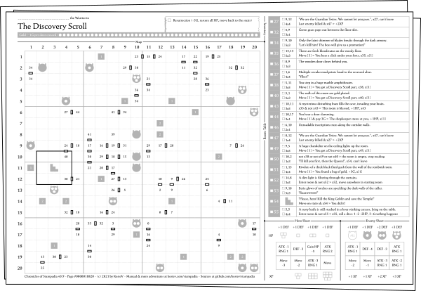
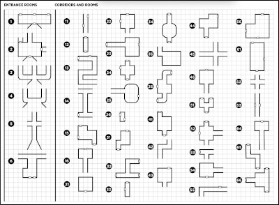
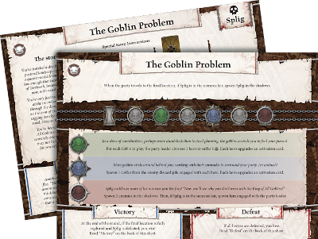
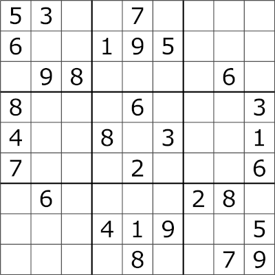
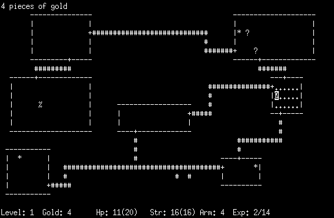

# Chronicles of Stampadia

A print-and-play roguelike with a new adventure every day!

---

<a href="https://www.kesiev.com/stampadia">Play today's adventure</a> | <a href="manuals/manual.pdf">Read the manual</a>

---

## The story

The reign of Stampadia had thousands of years of history of dangerous places and brave mercenaries before disappearing mysteriously from our globe. But Stampadia monks, generation after generation, managed to document relentlessly the story of every single adventurer, the map of every single dungeon, and the clue of every single mystery in a huge tome called _Chronicles Of Stampadia_.

    

We managed to find a damaged copy in an abandoned basement and it looks like that the book is imbued with some kind of magic: the reader can live every page of its story with just two dice, an eraser, and a small token! We’re trying to recover, translate and digitalize a new page of this book every day at [kesiev.com/stampadia](https://kesiev.com/stampadia). Go there, download the daily page, and bring back to life the story of a brave Stampadian!

### Play online

No printer or tokens? You can play Stampadia with a virtual pencil, eraser, some tokens, and dice [here](https://www.kesiev.com/stampadia/play.html).

## The game

_Chronicles of Stampadia_ is a print-and-play adventure with a little twist: the map, the enemies, the quests, the mysteries, and the traps are mixed and generated by an algorithm, as in a roguelike videogame. On the [Stampadia homepage](https://www.kesiev.com/stampadia) you will find a unique dungeon to download, print, and discover every day!

### Why?

I've got inspiration from several _analog_ interactive adventures that I have played in the past years, including board games, gamebooks, role-playing games, and small print-and-play games. I find it exceptional how many of them, with some cardboard or a pencil and a squared sheet, manage to offer complex, interactive, and engaging adventures, sometimes able to reach and overcome the most famous video games.

In my little and strictly amateur study of this game genre, I noticed that there are two common, difficult, and interesting design problems to face to create one of these: randomness control and hidden information management.

Many games implement progressive dungeon generation to convey that sense of discovery and unexpectedness: the classic [Dungeonquest](https://boardgamegeek.com/boardgame/71061/dungeonquest-third-edition) uses the random drawing of a dungeon tile from a pile, the fantastic [Four Against Darkness](https://boardgamegeek.com/boardgame/197097/four-against-darkness) uses dice rolls and a lookup table to decide the next room, and [Gloomhaven](https://boardgamegeek.com/boardgame/174430/gloomhaven)'s random dungeon generator uses a deck of cards to pick rooms and variants.

    

    
The Four Against Darkness dungeon generator uses two dice and a lookup table

These techniques, even the simplest ones, often succeed in their intent and are even able to generate interesting layouts but they also often need to introduce specific rules to manage the randomizer edge cases, one over all the formation of dead ends: in [Dungeonquest](https://boardgamegeek.com/boardgame/71061/dungeonquest-third-edition), for example, the player can always look for _a secret exit_ if he's stuck in a dead-end and [Four Against Darkness](https://boardgamegeek.com/boardgame/197097/four-against-darkness) asks the player to rotate and cut a room until it fits in the map.

Furthermore, these techniques hardly allow the addition of side-quests or complex main quests, mostly because the extraction and position of specific map modules are hard to guarantee: among the different narrative techniques of its modules, [Four Against Darkness](https://boardgamegeek.com/boardgame/197097/four-against-darkness) also has a fantastic sub-quest system that accompanies the heroes between different plays to get around the problem and improve replayability.

    

    
A Heroes Of Terrinoth quest progress every round, regardless the party position on the "map"

Furthermore, discovery is the key element of any good adventure and is rather difficult for a game printed on paper to hide information. Some games use decks of cards constructed face down and shuffled to hide events and places, such as [Heroes Of Terrinoth](https://boardgamegeek.com/boardgame/254591/heroes-terrinoth), games that mix all of its contents and rely on player's investigation skills to find the right one, such as [Mythos](https://boardgamegeek.com/boardgame/126100/mythos-tales) and some cool gamebooks such as [Vesta Shutdown](https://www.amazon.it/Vesta-Shutdown-Gabriele-Simionato/dp/8832259028) and games that simply give up, like colossal masterpieces [Gloomhaven](https://boardgamegeek.com/boardgame/174430/gloomhaven), that openly show the entire mission map and the treasure chests and enemies position to players at the very beginning.

### The project

Inspired by this creative challenge, I tried to imagine how to hide a pre-generated dungeon that the player can discover room after room like in a video game but on a printed sheet, trying to reduce spoiler opportunities as much as possible in the process. I wanted the solution to be simple and to require at most elementary calculations - possibly only one per room - so I'd be inspired by gamebooks and classic grid puzzles.

    

    
Sudoku

Then, I implemented a procedural dungeon generator that was able to mix quests, sub-quests, and traps into the map, as it usually happens in classic roguelike video games. From that games, I decided to take inspiration for the narrative style too, keeping it minimal and dry. I collaborated with several people to write the stories - we put in a little of lore here and there, but I don't want to spoil the surprise.

    

    
Rogue

Dungeons may be played a second time to aim for higher scores: knowing what's where increases your chances of surviving and beat the game dramatically and, during the testings, I've found that's a nice feature.

I got inspiration from computer roguelikes for the combat system guidelines too: a simple dice placement mechanic that's not too demanding, that needs some simple decision, and that can generate a tip of tension.

Finally, I wanted the whole adventure to fit into a single A4 sheet. The original idea was to add the manual on that same sheet but it was probably too ambitious.

I hope you find the project as fun as it was for me to put it together!

### Font

The game manual and the adventure sheets are using the excellent CC0 font [Seshat](http://dotcolon.net/font/seshat/) by Dot Colon. If you're going to have a look at the manual `assets/manual/manual.odt` and adventure sheet model `svg/model.svg` make sure you have got the font installed. A copy of the font is included in the `assets` directory.